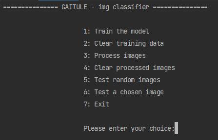
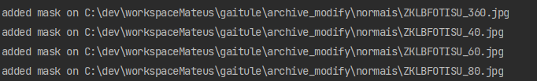
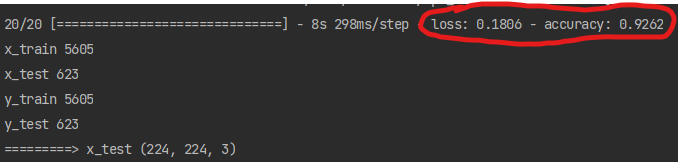
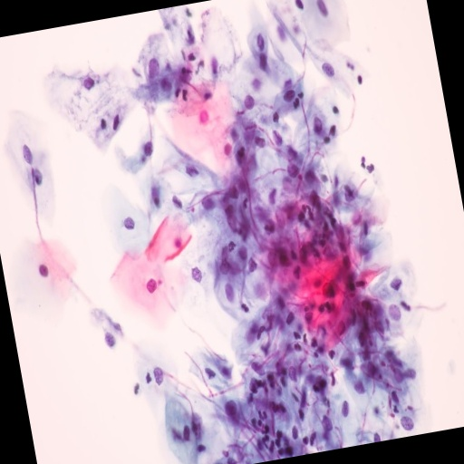
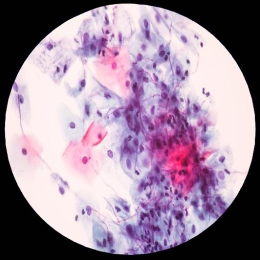
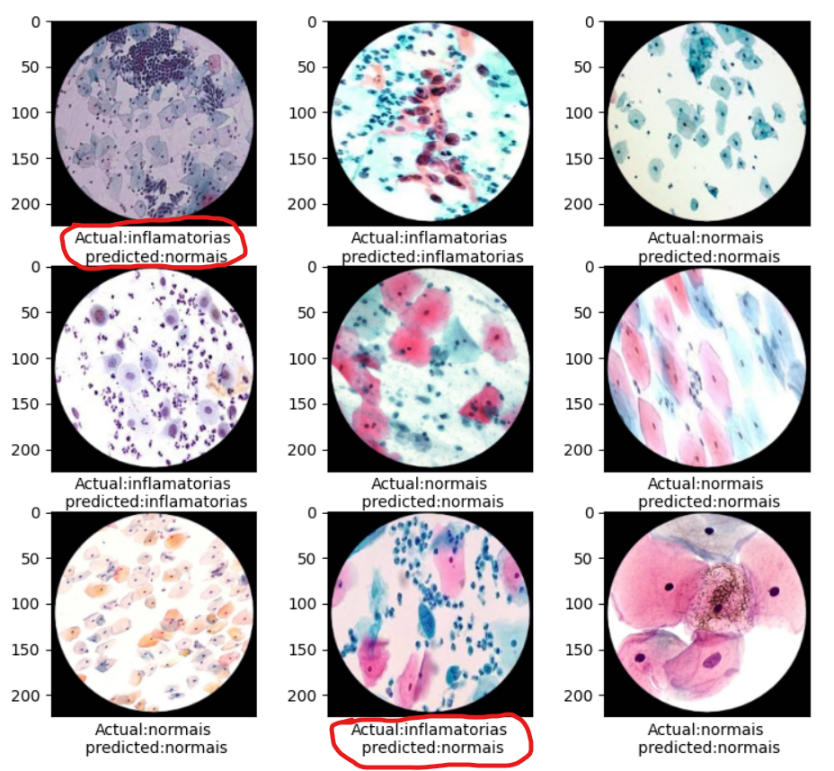
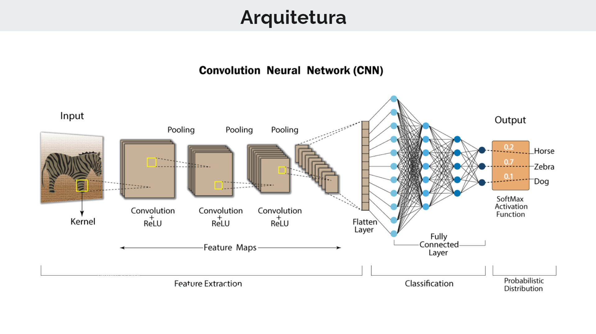
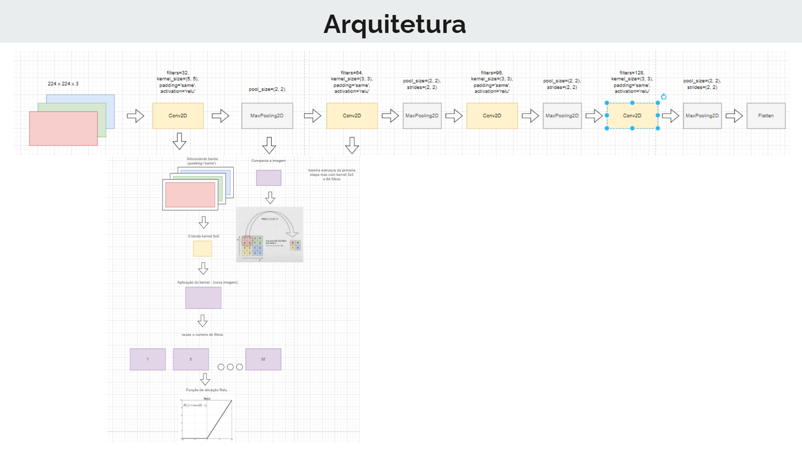

## Gaitule

Welcome to Gaitule, a system that aims to simplify the classification and training of models for computational image recognition.

---
## Technologies

- python
- tensorflow
- numpy
- cv2
- matplotlib
- sklearn
- pickle

---

## How it Works

Let's assume you are using Gaitule to classify images of dogs and cats.

```
    gaitule
        |_ archive
            |_ dog
            |_ cat
        |_ archive_modify
        |_ dataPickle
        |_ mask
        |_ model
        |_ properties
```


#### archive
 - In the archive folder, you should place the training images in respective folders named after the classifications
 
#### archive_modify
- When the images are processed, they will go to the archive_modify folder

#### archive_out_trained
- Intended for images that you want to test which were not used in training

#### dataPickle
- In dataPickle, the file used to serialize the object with the content of the processed images will be saved

#### mask
- Due to the image processing techniques such as mirroring and rotation, this folder stores the mask image that will be applied over all processed images  

#### model
- In the model folder, the training file generated by TensorFlow (.h5) will be stored

#### properties
- Here, the .json file with the necessary configurations for the system to run smoothly is stored. You need to configure some parameters:

```
{
  "model_file_save": "C:\\dev\\workspaceMateus\\gaitule\\model\\mymodel.h5",
  "pickler_file": "C:\\dev\\workspaceMateus\\gaitule\\dataPickle\\data.pickle",
  "dir_pictures_modify": "C:\\dev\\workspaceMateus\\gaitule\\archive_modify",
  "dir_pictures": "C:\\dev\\workspaceMateus\\gaitule\\archive",
  "circle_mask": "C:\\dev\\workspaceMateus\\gaitule\\mask\\circleMask.png",
  "categories": ["dog", "cat"],
  "degress_rotation_interval": 20,
  "normalize_size_image": 512
}
```


Add the directory of your project accordingly or change it to the directory you prefer, respecting the functionality of each folder.

---
## Running

Creating a virtual environment:

```
python -m venv env
```

Activating the virtual environment:

```
cd /env/Scripts/activate
```

Inside the virtual environment:

To install the dependencies, run the command:

```
pip install -r requirements.txt
```

Running:
```
python src/run.py
```


---

---

In the following example, a model was generated to classify cell images into the following categories:

```
- inflamatórias
- normais
```

When you start the program, you will see something like this:



When processing the images:



When testing random images, it is possible to verify the accuracy of the trained model:



Example of image processing, pre-training:

<div style="display: flex; justify-content: space-between;">
    
    
    
</div>

Example of image classification for inflammatory and normal cells:





---


### Architecture (CNN)





