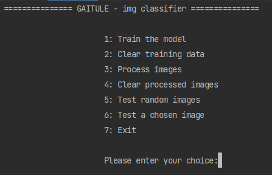
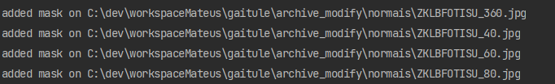
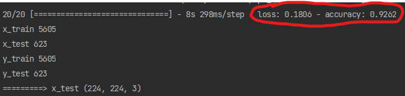
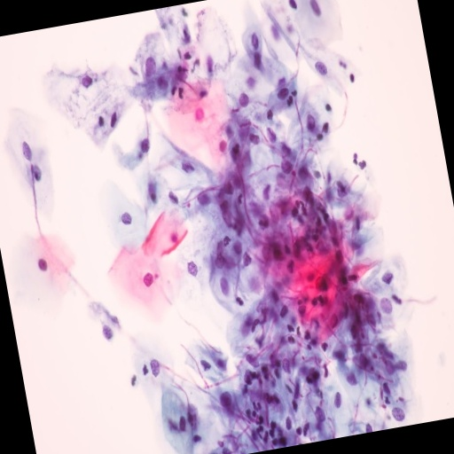
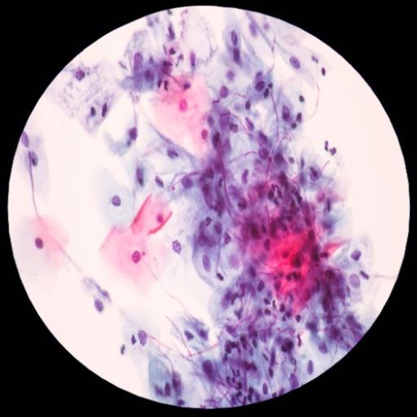
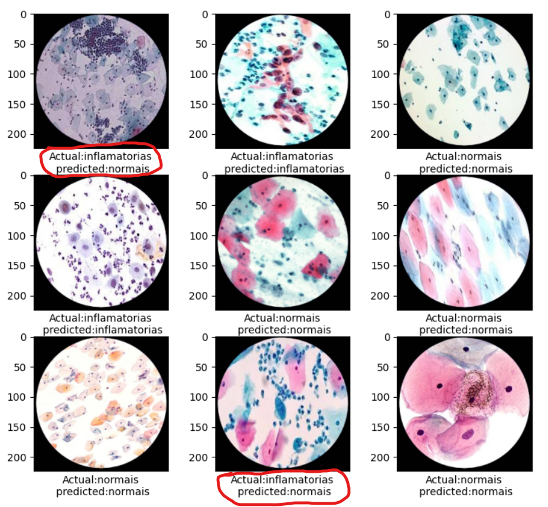
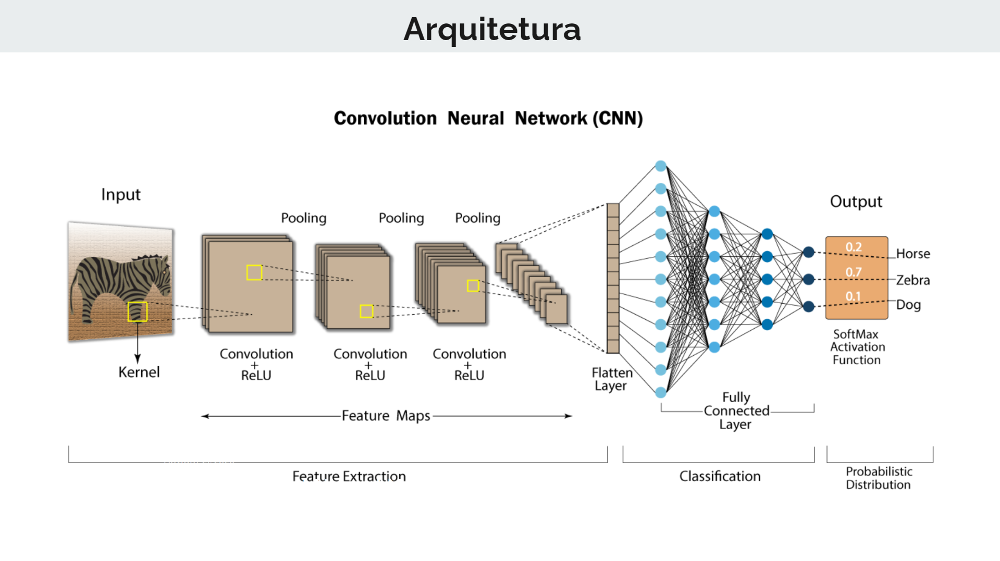
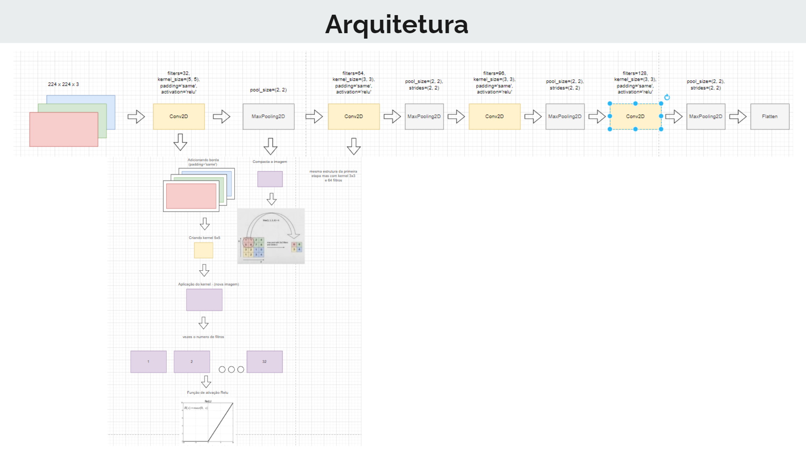

## Gaitule

Bem-vindos ao Gaitule, um sistema que busca simplificar a classificação e  
treinamento de modelos para reconhecimento computacional de imagens.

---
## Tecnologias

- python
- tensorflow
- numpy
- cv2
- matplotlib
- sklearn
- pickle

---

## Funcionamento

Supondo que você vá usar o Gaitule para fazer uma classificação
de cachorros e gatos.

```
    gaitule
        |_ archive
            |_ cachorro
            |_ gato
        |_ archive_modify
        |_ dataPickle
        |_ mask
        |_ model
        |_ properties
```

#### archive
 - Na pasta archive, você deverá colocar as imagens de treinamento 
em pastas respectivas com os nomes das classificações 
 
#### archive_modify
- Quando as imagens forem processadas, elas irão para o archive_modify

#### archive_out_trained
- Destinado as imagens que você quer testar que não foram usadas no treinamento

#### dataPickle
- Em dataPickle ficará salvo o arquivo usado para serializar o objeto com o conteudo das das imagens processadas 

#### mask
- Devido o processamento das imagens usar tecnicas como espelhamento e rotação, 
nesta pasta fica armazenado a imagem da mascara que será aplicada por cima de todas as imagens processadas  

#### model
- Em model ficara armazenado o arquivo de treinamento gerado pelo tersorflow .h5

#### properties
- Aqui fica armazenado o aquivo .json com as configurações necessárias para o sistema 
executar sem problemas, nele você precisa configurar alguns parametros:

```
{
  "model_file_save": "C:\\dev\\workspaceMateus\\gaitule\\model\\mymodel.h5",
  "pickler_file": "C:\\dev\\workspaceMateus\\gaitule\\dataPickle\\data.pickle",
  "dir_pictures_modify": "C:\\dev\\workspaceMateus\\gaitule\\archive_modify",
  "dir_pictures": "C:\\dev\\workspaceMateus\\gaitule\\archive",
  "circle_mask": "C:\\dev\\workspaceMateus\\gaitule\\mask\\circleMask.png",
  "categories": ["cachorro", "gato"],
  "degress_rotation_interval": 20,
  "normalize_size_image": 512
}
```

Adicione o diretorio do seu projeto respectivamente 
ou altere para o diretorio que preferir respeitando o funcionamento de cada pasta


---
## Executando


criando virtual env
```
python -m venv env
```

ligando virtual env:

```
cd /env/Scripts/activate
```


dentro do virtual env:

para instalar as dependencias execute o comando:

```
pip install -r requirements.txt
```

Executando:
```
python src/run.py
```

---
---

Neste exemplo a seguir, foi gerado um modelo para classificar \ 
imagens de células nas seguintes categorias:

```
- inflamatórias
- normais
```

Ao iniciar o programa você verá algo parecido com:



Ao processar as imagens: 



Ao testar imagens randomicas é possível verificar a acurácia do modelo treinado:



Exemplo de processamento de imagem, pré treinamento:

<div style="display: flex; justify-content: space-between;">
    
    
    
</div>

Exemplo de classificação de imagens para células inflamatórias e normais:




---


### Arquitetura (CNN)




